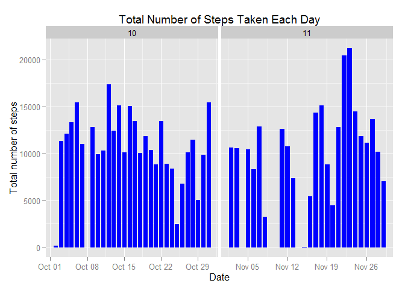
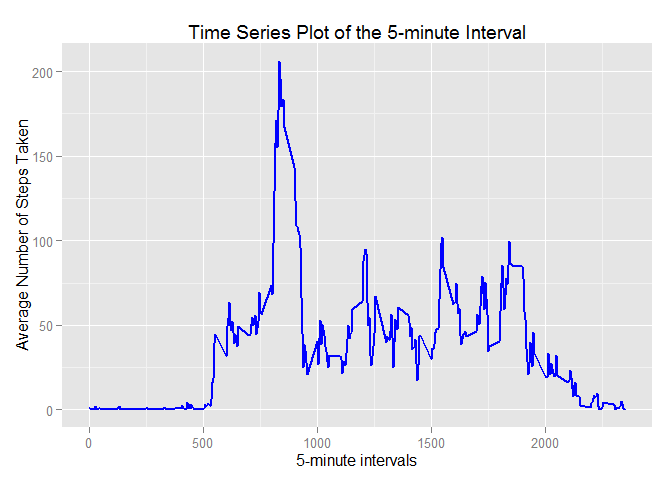
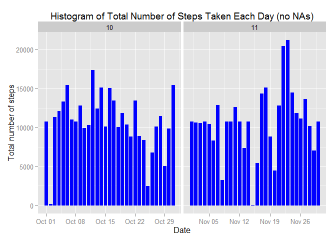

Reproducible Research: Peer Assessment 1
==========================================

Sunil Thomas


##Introduction
This assignment makes use of data from a personal activity monitoring device. This device collects data at 5 minute intervals through out the day. The data consists of two months of data from an anonymous individual collected during the months of October and November, 2012 and include the number of steps taken in 5 minute intervals each day.

##Data Source
**Dataset** Available here: [https://d396qusza40orc.cloudfront.net/repdata%2Fdata%2Factivity.zip](https://d396qusza40orc.cloudfront.net/repdata%2Fdata%2Factivity.zip)

**Fileformat** CSV

17,568 observations

**Variables:**

* _steps_: Number of steps taking in a 5-minute interval (missing values are coded as NA)

* _date_: The date on which the measurement was taken in YYYY-MM-DD format

* _interval_: Identifier for the 5-minute interval in which measurement was taken

### Settings

```r
echo = TRUE  # Always make code visible
options(scipen = 1)  # Turn off scientific notations for numbers
```

### Code for reading and pre-processing data

```r
unzip("activity.zip")
data <- read.csv("activity.csv", colClasses = c("integer", "Date", "factor"))
data$month <- as.numeric(format(data$date, "%m"))
data_clean <- na.omit(data)
rownames(data_clean) <- 1:nrow(data_clean)
```


### What is mean total number of steps taken per day?
For this part of the assignment, you can ignore the missing values in the dataset.

* Make a histogram of the total number of steps taken each day

```r
library(ggplot2)
ggplot(data_clean, aes(date, steps)) + geom_bar(stat = "identity", colour = "blue", fill = "blue", width = 0.7) + facet_grid(. ~ month, scales = "free") + labs(title = "Total Number of Steps Taken Each Day", x = "Date", y = "Total number of steps")
```

 


* Calculate and report the mean and median total number of steps taken per day

Mean total number of steps taken per day:

```r
totalSteps <- aggregate(data_clean$steps, list(Date = data_clean$date), FUN = "sum")$x
mean(totalSteps)
```

```
## [1] 10766.19
```
Median total number of steps taken per day:

```r
median(totalSteps)
```

```
## [1] 10765
```

### What is the average daily activity pattern?
* Make a time series plot (i.e. type = "l") of the 5-minute interval (x-axis) and the average number of steps taken, averaged across all days (y-axis)


```r
avgSteps <- aggregate(data_clean$steps, list(interval = as.numeric(as.character(data_clean$interval))), FUN = "mean")
names(avgSteps)[2] <- "meanOfSteps"

ggplot(avgSteps, aes(interval, meanOfSteps)) + geom_line(color = "blue", size = 0.8) + labs(title = "Time Series Plot of the 5-minute Interval", x = "5-minute intervals", y = "Average Number of Steps Taken")
```

 

* Which 5-minute interval, on average across all the days in the dataset, contains the maximum number of steps?

```r
avgSteps[avgSteps$meanOfSteps == max(avgSteps$meanOfSteps), ]
```

```
##     interval meanOfSteps
## 104      835    206.1698
```


### Imputing missing values
* The total number of rows with NAs:


```r
sum(is.na(data))
```

```
## [1] 2304
```

* Devise a strategy for filling in all of the missing values in the dataset. The strategy does not need to be sophisticated. For example, you could use the mean/median for that day, or the mean for that 5-minute interval, etc.

Missing value treatment is done by filling the missing values with the mean.

* Create a new dataset that is equal to the original dataset but with the missing data filled in.


```r
data2 <- data 
for (i in 1:nrow(data2)) {
    if (is.na(data2$steps[i])) {
        data2$steps[i] <- avgSteps[which(data2$interval[i] == avgSteps$interval), ]$meanOfSteps
    }
}

sum(is.na(data2))
```

```
## [1] 0
```


* Make a histogram of the total number of steps taken each day and Calculate and report the mean and median total number of steps taken per day. 


```r
ggplot(data2, aes(date, steps)) + geom_bar(stat = "identity",
                                             colour = "blue",
                                             fill = "blue",
                                             width = 0.7) + facet_grid(. ~ month, scales = "free") + labs(title = "Histogram of Total Number of Steps Taken Each Day (no NAs)", x = "Date", y = "Total number of steps")
```

 

* Do these values differ from the estimates from the first part of the assignment? What is the impact of imputing missing data on the estimates of the total daily number of steps?

Mean total number of steps taken per day:

```r
newTotalSteps <- aggregate(data2$steps, 
                           list(Date = data2$date), 
                           FUN = "sum")$x
newMean <- mean(newTotalSteps)
newMean
```

```
## [1] 10766.19
```
Median total number of steps taken per day:

```r
newMedian <- median(newTotalSteps)
newMedian
```

```
## [1] 10766.19
```
Compare them with the two before imputing missing data:

```r
oldMean <- mean(totalSteps)
oldMedian <- median(totalSteps)
newMean - oldMean
```

```
## [1] 0
```

```r
newMedian - oldMedian
```

```
## [1] 1.188679
```
After imputing the missing data 

* The new mean of total steps taken per day is the same as the old mean
* The new median of total steps taken per day is greater than the old median

### Are there differences in activity patterns between weekdays and weekends?

* Create a new factor variable in the dataset with two levels -- "weekday" and "weekend" indicating whether a given date is a weekday or weekend day.


```r
head(data2)
```

```
##       steps       date interval month
## 1 1.7169811 2012-10-01        0    10
## 2 0.3396226 2012-10-01        5    10
## 3 0.1320755 2012-10-01       10    10
## 4 0.1509434 2012-10-01       15    10
## 5 0.0754717 2012-10-01       20    10
## 6 2.0943396 2012-10-01       25    10
```

```r
data2$weekdays <- factor(format(data2$date, "%A"))
levels(data2$weekdays)
```

```
## [1] "Friday"    "Monday"    "Saturday"  "Sunday"    "Thursday"  "Tuesday"  
## [7] "Wednesday"
```

```r
levels(data2$weekdays) <- list(weekday = c("Monday", "Tuesday",
                                             "Wednesday", 
                                             "Thursday", "Friday"),
                                 weekend = c("Saturday", "Sunday"))
levels(data2$weekdays)
```

```
## [1] "weekday" "weekend"
```

```r
table(data2$weekdays)
```

```
## 
## weekday weekend 
##   12960    4608
```

* Make a panel plot containing a time series plot (i.e. type = "l") of the 5-minute interval (x-axis) and the average number of steps taken, averaged across all weekday days or weekend days (y-axis).


```r
avgSteps <- aggregate(data2$steps, 
                      list(interval = as.numeric(as.character(data2$interval)), 
                           weekdays = data2$weekdays),
                      FUN = "mean")
names(avgSteps)[3] <- "meanOfSteps"
library(lattice)
xyplot(avgSteps$meanOfSteps ~ avgSteps$interval | avgSteps$weekdays, 
       layout = c(1, 2), type = "l", 
       xlab = "Interval", ylab = "Number of steps")
```

 
